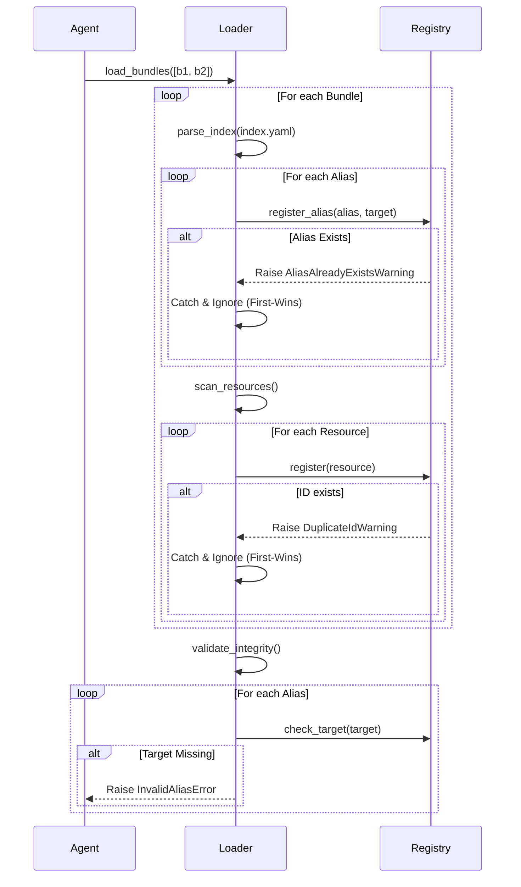

# Технологическое Решение: Aliases in DCL instructions

**Версия:** 2.0 (Draft)
**Основание:** [REQ-002_Aliases_in_DCL_instructions.md](file:///c:/git/dcl/.workspace/SP-002_Aliases_in_DCL_instructions/REQ-002_Aliases_in_DCL_instructions.md)

---

## 1. Архитектура Системы

### 1.1 Общие Принципы
*   **Multi-Bundle Awareness:** Агент оперирует множеством загруженных бандлов, объединенных в единый реестр.
*   **Alias First:** Разрешение имен приоритизирует алиасы из `index.yaml`.
*   **Strict Integrity:** Валидация целостности (битые ссылки) выполняется после полной загрузки.

### 1.2 Компоненты (Changes)
1.  **AgentLoader:** Расширен для итеративной загрузки списка бандлов и парсинга `index.yaml`.
2.  **PromptModuleRegistry:**
    *   Добавлен индекс для `aliases`.
    *   Реализована логика `First-Wins` для регистрации.
    *   Реализована логика `Content Check` для дедупликации ID.

---

## 2. Стек Технологий (Technology Stack)
*   **Parsing:** `PyYAML` — для разбора `index.yaml` и метаданных модулей.
*   **Filesystem:** `pathlib` — для рекурсивного сканирования.
*   **Error Handling:** Custom Exception classes (см. раздел 3).

---

## 3. Архитектура и Проектирование Компонентов

### 3.1 Exception Handling Strategy
*   **Decision:** Использование специализированных исключений для *всех* нестандартных ситуаций.
*   **Classes:**
    *   `DCLConfigurationError(Exception)`: Базовый класс для фатальных ошибок.
        *   `InvalidAliasError`: Ошибка целостности (битая ссылка).
    *   `DCLConfigurationWarning(Warning)`: Базовый класс для неблокирующих уведомлений.
        *   `AliasAlreadyExistsWarning`: Выбрасывается реестром при попытке переопределения алиаса. `Loader` ловит его и реализует стратегию "First-Wins" (игнорирует или логирует).
        *   `DuplicateIdWarning`: Выбрасывается реестром при обнаружении дубликата ID. `Loader` ловит его и реализует стратегию "First-Wins".
    *   (Deleted RedundantModuleWarning as content check is removed).

### 3.2 Loading & Resolution Strategy
*   **Phase 1 (Index):** Регистрация алиасов. Стратегия `First-Wins` (`AliasAlreadyExistsWarning` handled by Loader).
*   **Phase 2 (Scan):** Регистрация ресурсов. Стратегия `First-Wins` (`DuplicateIdWarning` handled by Loader).
*   **Phase 3 (Validate):** Проверка всех targets в алиасах на существование.

---

## 4. Детальная последовательность выполнения (Sequence Flow)

**Контекст:** Инициализация агента списком путей `[bundle_1, bundle_2]`.

1.  **[Agent] Инициализация:**
    *   Агент вызывает `Loader.load_bundles()`, передавая список путей к бандлам. Loader обрабатывает список последовательно.

2.  **[Loader] Фаза 1: Индексация (Index Phase):**
    *   Для каждого бандла Loader находит и парсит `index.yaml`.
    *   Вызывает `Registry.register_alias(alias, target)` для каждой записи.
    *   **Стратегия First-Wins:** Если алиас уже существует, Registry выбрасывает `AliasAlreadyExistsWarning`. Loader ловит его и игнорирует (сохраняет старое значение).

3.  **[Loader] Фаза 2: Сканирование (Scan Phase):**
    *   Loader рекурсивно сканирует директорию бандла.
    *   Для каждого файла определяет тип (Module/Raw) и ID.
    *   Вызывает `Registry.register(resource)`.
    *   **Стратегия First-Wins:** Если ID уже занят, Registry выбрасывает `DuplicateIdWarning`. Loader ловит его и игнорирует (сохраняет старое значение).

4.  **[Loader] Фаза 3: Валидация (Validation Phase):**
    *   После завершения загрузки всех бандлов, Loader вызывает `Registry.validate_aliases()`.
    *   Проверяется, что каждый target в алиасах указывает на существующий модуль или ресурс.
    *   **Integrity Check:** Если target отсутствует, выбрасывается `InvalidAliasError` (Fatal).



---

## 5. API Контракты (API Contracts)

### 5.1 Domain Objects

```python
@dataclass
class PromptModule:
    id: str
    version: str
    # Content not needed for design logic anymore (Strict ID check)
    # ... other fields
```

### 5.2 Interface `PromptModuleRegistry`

```python
class PromptModuleRegistry:
    def register(self, module: PromptModule) -> None:
        """
        Registers a module.
        Raises:
            DuplicateIdWarning: If ID exists (First-Wins).
        """
        pass

    def register_alias(self, alias: str, target: str) -> None:
        """
        Registers an alias. 
        Strategy: First-Wins (no error on duplicate).
        """
        pass

    def validate_aliases(self) -> None:
        """
        Checks all registered aliases point to existing IDs.
        Raises:
            InvalidAliasError: If any target is missing.
        """
        pass

    def get(self, key: str) -> Optional[Union[PromptModule, Path]]:
        """
        Resolves Key -> Target (if alias) -> Object.
        """
        pass
```

### 5.3 Interface `Loader`

```python
class Loader:
    def load_bundles(self, bundle_paths: List[str]) -> None:
        """
        Orchestrates the loading process.
        Raises:
            DCLConfigurationError: On any fatal error (Duplicate Content, Invalid Alias).
        """
        pass
```
