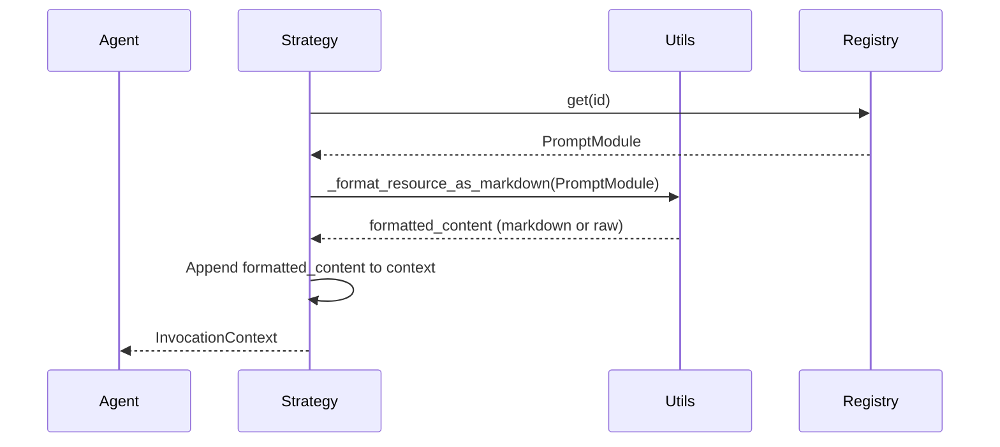

# TSD-003: Дизайн форматирования ресурсов в Invocation Context (DRAFT)

**Версия:** 1.0-draft  
**Создано:** 2025-12-18  
**Спринт:** SP-003  
**База:** [REQ-003](file:///.workspace/SP-003_invocation_context_strategies_refinement/REQ-003_Resources_Formatting.md)

---

## 1. Scope and Context

Реализация автоматического markdown-оборачивания содержимого объектов `PromptModule` с `type == 'RESOURCE'` при сборке контекста. Цель — улучшение читаемости контекста для LLM.

---

### 2.1 Утилитарный метод форматирования
Логика оборачивания выносится в базовый модуль стратегий для переиспользования. Никаких дополнительных настроек или флагов в интерфейс стратегий не вводится.

### 2.2 Локальное применение
Форматирование применяется непосредственно в коде методов `assemble` (или их помощников) конкретных стратегий (`GeminiNativeStrategy`, `ConcatenationStrategy`) путем вызова утилитарного метода.

---

## 3. Component Changes

### 3.1 Strategies Base (`src/dcl_agent/strategies/base.py`)
- Реализация функции или статического метода `_format_resource_as_markdown(module: PromptModule) -> str`.
- Метод принимает `PromptModule`, проверяет `module.type == 'RESOURCE'` и возвращает обернутый контент. Если тип иной — возвращает контент без изменений.

### 3.2 GeminiNativeStrategy (`src/dcl_agent/strategies/gemini.py`)
- Вызов метода форматирования при создании `TextFrame` для источников (`sources`), модификаторов (`modifiers`) и целей (`goals`), если они являются ресурсами.

### 3.3 ConcatenationStrategy (`src/dcl_agent/strategies/concat.py`)
- Вызов метода форматирования внутри `_format_module` или на этапе сборки частей контента.

---

## 4. Detailed Sequence Flow



---

## 5. API Contracts

```python
# В src/dcl_agent/strategies/base.py или аналогичном месте
def _format_resource_as_markdown(module: PromptModule) -> str:
    """
    Wraps module content in markdown if module.type == 'RESOURCE'.
    Otherwise returns raw content.
    """
    pass
```

---

## 6. References
- [REQ-003](file:///.workspace/SP-003_invocation_context_strategies_refinement/REQ-003_Resources_Formatting.md)
